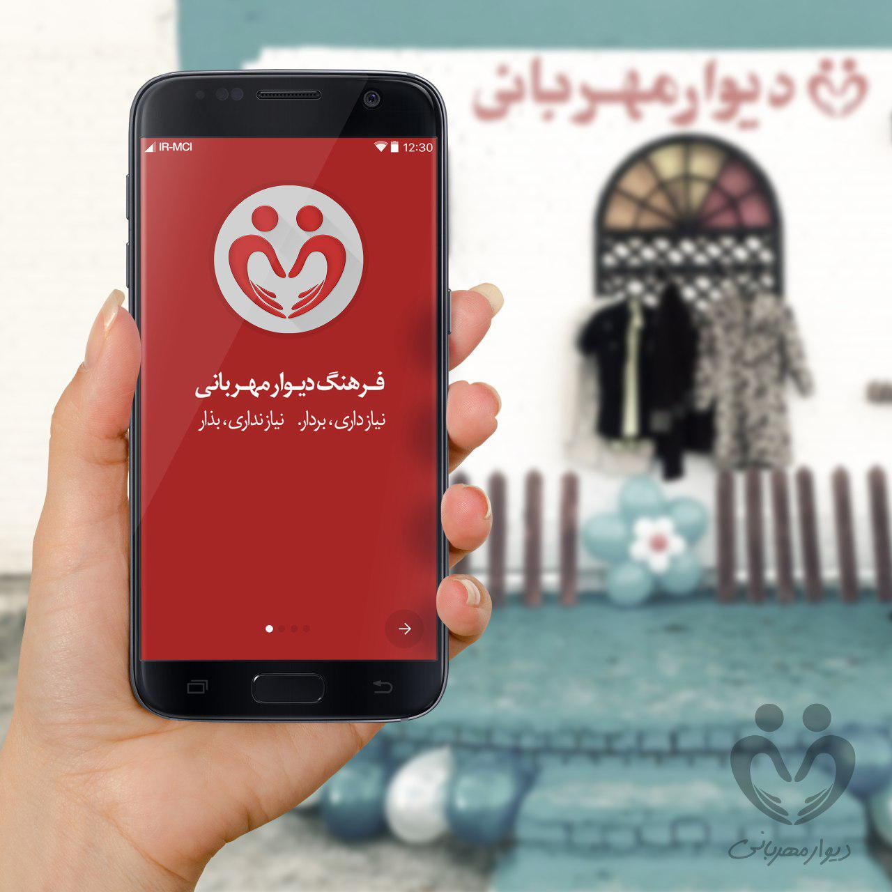
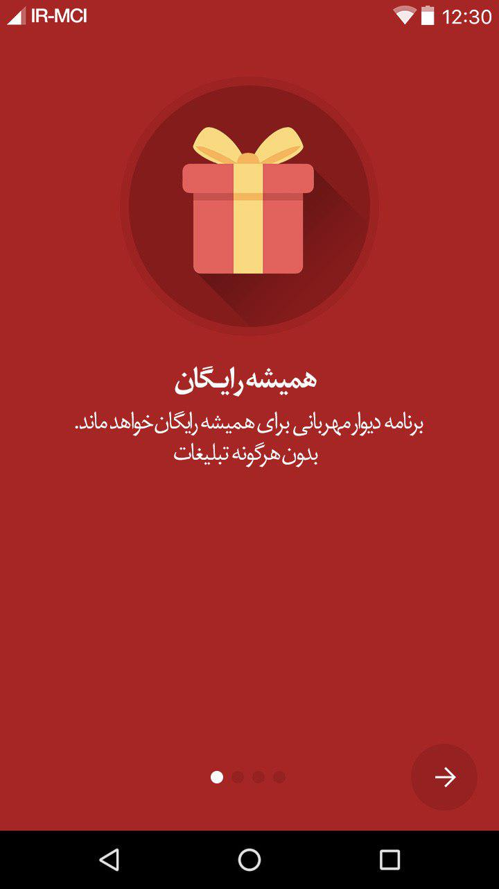

# دیوار مهربانی
دیواری برای هدیه دادن به افرادی که نمی شناسیم
[برای آشنایی بیشتر با فرهنگ دیوار مهربانی به ویکیپدیا مراجعه کنید](https://fa.wikipedia.org/wiki/%D8%AF%DB%8C%D9%88%D8%A7%D8%B1_%D9%85%D9%87%D8%B1%D8%A8%D8%A7%D9%86%DB%8C)

The kindness wall (Dewar e meherbani) is a charity work phenomenon and a kind of welfare, usually done by attaching cloth hangers from outside of houses; those encourage people to donate miscellaneous useful things such as winter clothing. 

[Read more about kindness wall in Wikipedia](https://en.wikipedia.org/wiki/Wall_of_kindness)

